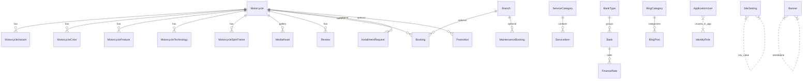

# Admin → Motorcycle CMS — Architecture Audit & Blueprint

> Project: **Xe Máy Hiếu Nga** · ASP.NET Core Razor Pages · PostgreSQL · Cloudinary · Render · Neon  
> Status: **Audit complete · Phase 1 implemented** · Phases 2–6 deferred  
> Rule: No Honda.com.vn source copy; no business-logic redesign in Phase 1

---

## 1. Executive Summary

The public site is largely done. Admin grew as **organic CRUD islands**: some modules use the newer `admin.css` design system (Xe, DichVu BangGia, Dashboard); others still use **Tailwind utility classes under a layout that does not load Tailwind** — those screens look broken/unstyled in production.

There is **no Media Library**, **no Review moderation**, **no multi-role RBAC** (Identity exists; roles unused), and Motorcycle editing is split across **Them/Sua + Gia + NoiDung** without tabs. Image uploads call `IImageStorageService` from multiple page handlers but never persist a unified `MediaAsset` catalog.

**Recommendation:** Treat Admin as a Motorcycle CMS. Phase 1 = information architecture + shared UI foundation (no DB break). Phase 2 = Motorcycle tabbed CMS. Later = Media Library, Content, Finance, Settings.

---

## 2. Current Admin Architecture

### 2.1 Current Sitemap (live routes)

| Module | Routes | Notes |
|--------|--------|-------|
| Auth | `/admin/dang-nhap` | Anonymous; Identity cookie |
| Dashboard | `/admin` | Counts: bikes, promos, posts, bookings |
| Motorcycles | `/admin/xe`, `/them`, `/sua/{id}`, `/xoa/{id}`, `/{id}/gia`, `/{id}/noi-dung` | Fragmented editor |
| Service categories | `/admin/dich-vu/danh-muc` | Inline CRUD |
| Service items | `/admin/dich-vu/bang-gia`, `/them`, `/sua/{id}` | Uses admin-* tokens |
| Banks | `/admin/tra-gop/ngan-hang` | Inline CRUD |
| Interest rates | `/admin/tra-gop/lai-suat` | Inline CRUD |
| Banner | `/admin/banner`, `/them`, `/sua/{id}` | Legacy Tailwind markup |
| Promotions | `/admin/khuyen-mai`, `/them`, `/sua/{id}` | Legacy Tailwind |
| News | `/admin/tin-tuc`, `/them`, `/sua/{id}` | Legacy Tailwind |
| Branches | `/admin/chi-nhanh`, `/them`, `/sua/{id}` | Legacy Tailwind |
| Site settings | `/admin/cai-dat` | Key/value groups |
| Appointments | `/admin/khach-hang/lich-hen`, `/{id}` | Booking |
| Maintenance leads | `/admin/khach-hang/bao-duong`, `/{id}` | MaintenanceBooking |
| Installment leads | `/admin/khach-hang/tra-gop`, `/{id}` | InstallmentRequest |

### 2.2 Navigation Tree (before Phase 1)

```
Tổng quan → Dashboard
Kinh doanh xe → Danh sách xe, Thêm xe mới   ← "Thêm" is an action, not a module
Dịch vụ → Danh mục, Bảng giá
Trả góp → Ngân hàng, Lãi suất
Nội dung → Banner, KM, Tin, Chi nhánh, Cài đặt   ← Site settings mixed into Content
Khách hàng → Lịch hẹn, Bảo dưỡng, Trả góp
```

### 2.3 Dependencies

| Layer | Admin usage |
|-------|-------------|
| PageModels | Often inject `HieuNgaDbContext` / `IRepository` directly — bypass Application services |
| Shared partials | `_MotorcycleForm`, `_ServiceItemForm`, `_BannerForm`, `_BranchForm`, `_BlogPostForm`, `_PromotionForm`, `_SeoFields` |
| Upload | `IImageStorageService` + `MotorcycleImageUploadHelper`; NoiDung handlers upload ad hoc |
| Auth | `AuthorizeFolder("/Admin")` + Identity cookie; no roles |
| CSS | `admin.css` only in layout; legacy pages assume Tailwind |
| JS | No admin.js historically; inline sidebar + slug scripts |

### 2.4 Duplicate / dead / unused

| Finding | Detail |
|---------|--------|
| Duplicate CRUD pattern | Lead ChiTiet pages nearly identical (status + AdminNotes) |
| Duplicate upload | Thumbnail (Them/Sua), Color/Feature/Tech/360 (NoiDung) — same storage API, different UI |
| Duplicate tables | Each list invents its own table/card markup |
| Dead pages | **None** — all routes serve a purpose |
| Unused entities in Admin | `Review`, `MediaAsset` (as catalog), Identity `Role` |
| Unused CSS | `admin-badge-warning`; base `.admin-btn` rarely used alone |
| Unused JS | No orphaned admin JS files |
| Legacy pages | Banner, KhuyenMai, TinTuc, ChiNhanh, TraGop inline, KhachHang lists, CaiDat, NoiDung — Tailwind or one-off styles |
| Technical debt | Long motorcycle forms; JSON specs as textarea; URL fields still present; Admin bypasses Application layer |

---

## 3. Problems Found

1. **Broken visual system on Content pages** — Tailwind classes without Tailwind CSS in Admin layout.  
2. **IA mismatch** — Settings under Content; “Thêm xe” as nav sibling; no Inventory/Media/Users groups.  
3. **Motorcycle CMS fragmented** — General / Price / Media-content on three URLs without a tab shell.  
4. **No Media Library** — Cloudinary URLs stored on entities; `MediaAsset` unused by Admin.  
5. **Upload UX inconsistent** — Mix of URL inputs + file inputs; no drag-drop / reorder shared component.  
6. **No RBAC** — Single admin; Identity roles unused.  
7. **Reviews invisible** — Seeded/public but no moderation UI.  
8. **Dashboard incomplete** — Ignores maintenance + installment lead volumes.  
9. **Application layer skipped** — Many Admin pages talk to DbContext/repos directly.  
10. **Category confusion** — Motorcycle categories are an enum (not a DB entity); Service/Blog categories are entities.

---

## 4. New CMS Blueprint

Transform Admin into a **Motorcycle CMS** with clear module ownership.

| Module | Owns | Does not own |
|--------|------|--------------|
| Inventory | Motorcycles, category labels (enum→future entity), publish | Leads, banks |
| Service | ServiceCategory, ServiceItem, Appointments (Booking + Maintenance) | Finance calculator config |
| Finance | Bank, FinanceRate, InstallmentRequest inbox | Motorcycle pricing |
| Content | Banner, Promotion, BlogPost (+ BlogCategory) | SiteSetting |
| Media | MediaAsset catalog, upload/delete/reuse | Entity-specific sort (links only) |
| Site | Branch, SiteSetting, SEO defaults | Content posts |
| Users | ApplicationUser, roles, activity | Public customers |
| Dashboard | Aggregates + shortcuts | CRUD |

**Motorcycle editor (Phase 2 target):** single route with **Tabs** — General | Media | Colors | 360 | Features | Technology | Specs | Variants/Finance | SEO | Publishing. Avoid one endless form.

---

## 5. Navigation Tree (target)

```
Dashboard

Inventory
  ├─ Motorcycles          /admin/xe
  └─ Categories           (Phase 2+: manage labels/order; today enum-backed)

Service
  ├─ Services             /admin/dich-vu/bang-gia
  ├─ Service categories   /admin/dich-vu/danh-muc
  └─ Appointments         /admin/khach-hang/lich-hen (+ bao-duong)

Finance
  ├─ Banks                /admin/tra-gop/ngan-hang
  ├─ Interest Rates       /admin/tra-gop/lai-suat
  └─ Installment requests /admin/khach-hang/tra-gop

Content
  ├─ Promotions           /admin/khuyen-mai
  ├─ News                 /admin/tin-tuc
  └─ Banner               /admin/banner

Media Library             (Phase 3 — placeholder link or hidden until built)

Site
  ├─ Branches             /admin/chi-nhanh
  └─ Settings             /admin/cai-dat

Users                     (Phase 6 — Identity management)

Settings                  (alias / deep-link to Site Settings; or merge)
```

Phase 1 implements this tree with **existing routes** (no Media/Users pages yet — omitted or marked “soon”).

---

## 6. Entity Diagram



### Ownership recommendations

| Concept | Current | Proper ownership |
|---------|---------|------------------|
| Motorcycle “Category” | Enum on Motorcycle | Keep enum short-term; optional `MotorcycleCategoryEntity` later for CMS-editable labels |
| Gallery | `MediaAsset` + ThumbnailUrl string | Media Library owns files; Motorcycle owns ordered links |
| Specs | `TechnicalSpecsJson` | Keep JSON or normalize to Spec rows — Phase 2 decision |
| 360 | `MotorcycleSpinFrame` | Correct — owned by Motorcycle |
| Feature vs Technology | Near-identical shapes | Keep separate for UX sections; share UI component |
| InterestRate | `FinanceRate` | Name in UI “Lãi suất”; entity OK |
| Appointments | Booking + MaintenanceBooking | Two types under Service → Appointments |

### Duplicated / wrong responsibilities

- **Feature ≈ Technology** entity shape — OK for content sections; share Admin editor component.  
- **MediaAsset unused** while URL strings proliferate — wrong; Media should own blobs.  
- **SEO fields copied** on many entities — OK for CMS; keep `_SeoFields`.  
- **BankType** barely managed — auto-seeded; OK until Finance CMS phase.

---

## 7. Technical Debt

| Debt | Severity | Phase |
|------|----------|-------|
| Tailwind-without-Tailwind on Content lists | High (UX) | **1** |
| Flat nav / wrong grouping | Medium | **1** |
| Motorcycle multi-page editor | High | **2** |
| No unified Media service UI | High | **3** |
| Admin → DbContext bypass | Medium | 2–6 gradual |
| No Review Admin | Medium | 4 |
| No RBAC | Medium | 6 |
| URL + file dual inputs | Medium | 2–3 |
| Lead ChiTiet triplication | Low | 4–5 |
| Inter font + Honda tokens only | Low | 1 DS tokens |

---

## 8. Phase Roadmap (independently deployable)

### Phase 1 — Quick wins *(this delivery)*
- Sidebar IA cleanup  
- Shared page header / form card / empty / upload / list-item components  
- Extract `admin.js`  
- Restyle broken Content list pages to `admin.css`  
- **No DB migrations · routes preserved · no business logic change**

### Phase 2 — Motorcycle CMS
- Tabbed editor shell at `/admin/xe/sua/{id}` (or unified `/admin/xe/{id}`)  
- Drag-drop upload, reorder, preview  
- Merge NoiDung + Gia into tabs (redirect old URLs)

### Phase 3 — Media Library
- CRUD MediaAsset; picker modal; retire raw URL fields where possible  
- Single `IAdminMediaService` wrapping `IImageStorageService`

### Phase 4 — Content CMS
- Banner / News / Promotions polish + shared list tables  
- Review moderation  
- Shared lead detail partial

### Phase 5 — Finance CMS
- Banks + rates UX; installment inbox polish  
- Align naming Interest Rates

### Phase 6 — Settings & Users
- Site settings IA; Branch polish  
- RBAC (Admin / Editor / Staff)  
- User invite/disable

---

## 9. Module Audit (summary matrix)

| Module | Purpose | UX problems | Tech problems | Data problems | Redesign | Complexity | Risk |
|--------|---------|-------------|---------------|---------------|----------|------------|------|
| Dashboard | Overview | Incomplete KPIs | — | Missing lead types | Enrich cards | Low | Low |
| Motorcycles | Inventory CMS | Fragmented, long forms | Direct DB | JSON specs; dual media | Tabs | High | Med |
| Categories (moto) | Filter labels | No CMS page | Enum only | Hard-coded | Optional entity | Med | Low |
| Services | Workshop catalog | OK on BangGia | Mixed styles on DanhMuc | — | Align DS | Med | Low |
| Appointments | Lead inbox | Duplicate UIs | — | Two entities | Unified inbox | Med | Low |
| Banks / Rates | Finance config | Inline CRUD dense | — | BankType hidden | Dedicated forms | Med | Med* |
| Promotions/News/Banner | Marketing | Broken Tailwind | URL images | No Media link | Media picker | Med | Low |
| Branches | Locations | Broken Tailwind | — | — | Form DS | Low | Low |
| Settings | Site keys | Flat form | — | String values | Grouped tabs | Low | Low |
| Media | — | Missing | — | Orphan MediaAsset | New module | High | Med |
| Users | — | Missing | Roles unused | Single seed user | RBAC | Med | Med |
| Reviews | Social proof | Missing Admin | — | Unmoderated path | Moderate UI | Low | Low |

\*Finance calculator depends on rates — change carefully.

---

## 10. Motorcycle CMS recommendation (Phase 2 — design only)

**Best structure: Tabbed editor**

1. **General** — Name, slug, category, price, short/long description, featured, published  
2. **Media** — Thumbnail + gallery (MediaAsset) drag-drop  
3. **Colors** — Name, HEX, main image, order  
4. **360** — Multi upload, auto frame###, reorder  
5. **Features** — Title, description, image, order  
6. **Technology** — Same pattern  
7. **Specifications** — Structured rows (Label/Value) not only textarea  
8. **Variants / Finance** — Move Gia here  
9. **SEO** — `_SeoFields`  
10. **Publishing** — Status, sort, preview link  

Avoid long single forms. Support preview, reorder, drag-drop.

---

## 11. Media Management Audit

### Upload entry points today

| Entry | Mechanism |
|-------|-----------|
| Xe Them/Sua ThumbnailFile | `MotorcycleImageUploadHelper` → `IImageStorageService` |
| Xe NoiDung Color/Feature/Tech/Spin | Direct `UploadAsync` in handlers |
| Banner / Promo / Blog / Branch | **URL text fields** (`_BannerForm` etc.) |
| SEO OgImageUrl | URL text on many forms |
| Seed / Enricher | Catalog URLs + MediaAsset inserts (not Admin) |

### Problems
- Duplicate upload UIs  
- URL fields encourage bypass of storage  
- No delete-from-Cloudinary lifecycle  
- MediaAsset not the source of truth  

### Proposed unified Media service (Phase 3)

```
IAdminMediaService
  Upload(stream, folder, alt) → MediaAsset
  Attach(entityType, entityId, mediaId, role, sort)
  Detach / Reorder / SoftDelete
  List(filter) for Media Library picker
```

Wrap existing `IImageStorageService` (Cloudinary prod / Local dev).

---

## 12. Design System Audit

| Area | Current | Issue |
|------|---------|-------|
| Buttons | `admin-btn-primary/secondary/ghost` vs `bg-honda-red…` | Dual systems |
| Cards | `admin-card` vs `bg-white border rounded-2xl` | Dual |
| Forms | `admin-input` vs `border rounded-lg` | Dual |
| Tables | `admin-table` only on Xe/BangGia | Not shared |
| Dialogs/Drawer | None | Confirm via separate Xoa page |
| Sidebar | Flat groups | Needs CMS IA |
| Icons | Minimal SVG hamburger | No icon set |
| Dark mode | Not ready | CSS vars help later |
| Responsive | Sidebar drawer OK | Content padding OK |
| Typography | Inter | Fine for Admin |

**Proposed Admin DS (tokens already in `:root`):** keep CSS variables; ban Tailwind utilities in Admin views; shared partials for Header, FormCard, Empty, Upload, ListRow, Table wrap.

---

## 13. Permissions Audit (do not implement)

| Current | Future RBAC |
|---------|-------------|
| Anyone authenticated = full Admin | **Admin** — all modules |
| No roles assigned | **Editor** — Inventory + Content + Media; no Users/Finance delete |
| Single seeded user | **Staff** — Appointments + read Inventory; no publish |

Suggest claim/policy per module (`Inventory.Write`, `Finance.Manage`, …). Keep cookie auth.

---

## Sprint 2.3 — Motorcycle Content Builder (done)

Spec Builder (rows/groups/reorder/dup/preview) · shared Feature/Tech card builder · Finance prefs via SiteSetting (enable calculator, default bank/down/term + live preview) · SEO SERP/OG/counts · Publish badge/URL/duplicate · sticky tabs, Ctrl+S, unsaved badge.

Public detail: group specs + calculator visibility/defaults from CMS prefs. Calculator formula unchanged. No Media Library. No migration.


Media tab: drag/drop/paste thumbnail, visual gallery cards (caption via AltText, reorder, bulk delete, replace), color cards + live preview, 360 timeline with frame labels / missing-frame warning / animation preview.

Quick Create: Name + Category + Price + Thumbnail → Draft → Editor Media.

Upload helper unified in `MotorcycleImageUploadHelper`. No Media Library. No migration.


Unified editor at `/admin/xe/editor/{id?}` with tabs:
General · Media · Specifications · Features · Finance · SEO · Publish

Legacy redirects (308 permanent):
- `/admin/xe/them` → editor create
- `/admin/xe/sua/{id}` → editor?tab=general
- `/admin/xe/{id}/gia` → editor?tab=finance
- `/admin/xe/{id}/noi-dung` → editor?tab=media

No DB migration. Uploads still via `IImageStorageService`.


### Files modified
- `Pages/Admin/Shared/_AdminLayout.cshtml` — CMS navigation tree; `admin.js`
- `Pages/Admin/Index.cshtml` — Dashboard labels/shortcuts aligned to IA
- `Pages/Admin/Banner/Index.cshtml` — admin DS (was broken Tailwind)
- `Pages/Admin/KhuyenMai/Index.cshtml` — shared header + list
- `Pages/Admin/TinTuc/Index.cshtml` — shared header + list
- `Pages/Admin/ChiNhanh/Index.cshtml` — shared header + list
- `Pages/Admin/Xe/_MotorcycleForm.cshtml` — shared upload field
- `Pages/Admin/Extensions/AdminUi.cs` — Empty/Upload/ListItem models
- `wwwroot/css/admin.css` — list, media card, upload, nav polish
- `docs/ADMIN_CMS_ARCHITECTURE_AUDIT.md` — full audit + blueprint

### Files added
- `Pages/Admin/Shared/_AdminEmptyState.cshtml`
- `Pages/Admin/Shared/_AdminUploadField.cshtml`
- `Pages/Admin/Shared/_AdminListItem.cshtml`
- `Pages/Admin/Shared/_AdminFormCard.cshtml` + `_AdminFormCardEnd.cshtml`
- `Pages/Admin/Shared/_AdminTableWrap.cshtml` + `_AdminTableWrapEnd.cshtml`
- `wwwroot/js/admin.js`

### Files removed
- None (no dead routes deleted; “Thêm xe” removed from **nav only**, route `/admin/xe/them` kept)

### Migration
- **No**

### Build / Tests
- Release build succeeded
- Tests: 1 passed

